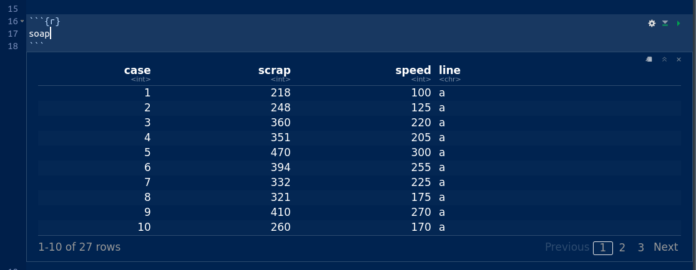

```{r setup, include=FALSE}
options(htmltools.dir.version = FALSE)
```


# This is a slide title

- with some bullet points under
- a second one
- even a third one
- maybe the text should be bigger

---

# This is some R code

```{r, include=FALSE}
library(tidyverse)
```


```{r}
my_url="http://www.utsc.utoronto.ca/~butler/c32/soap.txt"
soap=read_delim(my_url," ")
```

---

# And this is the output it produces

```{r}
soap
```

---

# and here is what it looks like in R Studio


... after you click the "play button":




---

# Idea from Garrick Aden-Buie

.pull-left[
```{r plot-label, eval=FALSE}
my_url="http://www.utsc.utoronto.ca/~butler/c32/soap.txt"
soap=read_delim(my_url," ")
soap
```

I'm not sure I like *this*, but it's a cool idea.

]

.pull-right[
```{r plot-label-out, ref.label="plot-label", echo=FALSE}
```
]

---

# Making a plot

using the same "delayed output" thing:

```{r lab2, eval=F}
ggplot(soap, aes(y=scrap, x=speed, colour=line))+
  geom_point()+
  geom_smooth(method="lm")
```

---

# The plot

```{r, ref.label="lab2", echo=FALSE}
```

---

# The plot, with comments


.pull-left[
```{r, ref.label="lab2", echo=FALSE}
```
]

.pull-right[

- the red line is above the blue one
- more scrap at any given speed on line A than line B
- scrap increases with speed (for both lines)
- two lines almost parallel: scrap increases with speed at same rate for both lines

]

---

# Another way to do the same thing 

... without the "envelopes" this time:

```{r lab3, fig.show='hide'}
ggplot(soap, aes(y=scrap, x=speed, colour=line))+
  geom_point()+
 {{geom_smooth(method="lm", se=F) }}
```

The last line changed, so I highlighted it. (It took a bit of fiddling to get the alignment to work.)

---

# and now to show it

`)


